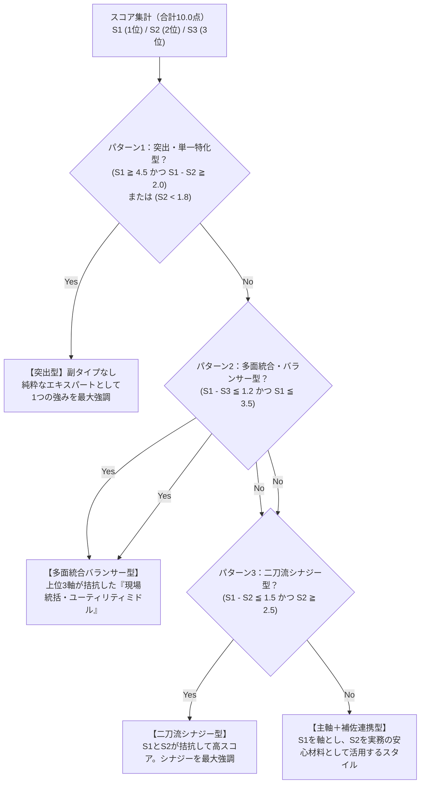

# 【提案型転職 5タイプ診断】10問シナリオ設問設計・精査シート

本シートは、「提案型転職 5タイプ価値観診断Webツール」に搭載する10問の状況判断シナリオについて、設問文・選択肢の具体性・配点ロジックを1問ずつ精査・推敲するための作業用Markdownファイルです。

---

## 1. 診断の全体設計と5つの評価軸（Type A〜E）

本診断は、40代・50代のビジネスパーソン（10年〜20年以上の実務経験を持つ層）が、従来の「検索型（SUUMO型）転職」で直面する壁を突破し、自分の強みに合った「提案型アプローチ」を見つけることを目的としています。

| タイプ | タイトル | 測定する中核価値観・行動特性 |
| :---: | :--- | :--- |
| **Type A** | **安定実行型** | 組織の守護神。業務の標準化、破綻のない運用、リスク管理、ミスのない確実な遂行を重視。 |
| **Type B** | **専門追求型** | プロフェッショナル。特定ドメインの深い知見、職人的スキル、難度の高い専門課題の解決を重視。 |
| **Type C** | **関係協働型** | チームのハブ。対話、傾聴、部署間調整、心理的安全性、周囲を支援して一体感をつくることを重視。 |
| **Type D** | **課題解決型** | ソリューション推進者。問題設定、仮説構築、業務プロセス改革、データや事実に基づく仕組み改善を重視。 |
| **Type E** | **事業創造型** | パイオニア。新事業・新ポジションの創出、ゼロイチの構想、リスクテイク、自ら旗を立てるリーダーシップを重視。 |

---

## 2. 設問精査における3つの評価軸

各設問および選択肢は、以下の3つの観点から精査・改善を行います。

1. **【理解度】**: 本コラムで言及するステータス（40代主体・キャリア10年以上のミドルシニア層）の読者が、違和感なく直感的に理解できる設問文か？（※年数表記等で限定しすぎない）
2. **【我が事化・具体性】**: 抽象論ではなく、現場のリアルな就業体験（組織の修羅場、板挟み、属人化、変革など）に根ざしており、読者が「これはまさに自分だ」と選べる選択肢になっているか？
3. **【配点ロジック（100点満点・順不同・マルチアンサー按分）】**: 
   * **回答の順不同シャッフル**: 診断実施時、各設問の選択肢はランダム（Fisher-Yatesアルゴリズム）に並び替えられます。これにより「上から順にA〜Eが並んでいる」という先入観やタイプ推測によるバイアスを完全に排除します。
   * **複数選択・100点満点按分配点**: 各設問（全10問）は「1問あたり10点」の重みを持ち、1問につき最大2個まで選択可能（1つなら10点、2つなら各5点）。10問の総得点は常に**合計100点満点**として整数で直感的に算出されます。

---

## 3. 全10問シナリオ 精査・レビュー一覧

各設問の下にある `【レビュー・修正メモ欄】` に、気になる点や調整案を直接ご記入・編集いただけます。

---

### 【Q1】これまでのキャリアで最も達成感を感じた瞬間（仕事の原点）

* **設問文**: これまでのキャリアで、最も達成感や「自分らしさ」を感じた瞬間は？
* **サブタイトル**: あなたが最もエネルギーを感じる仕事の原点を教えてください（※複数選択可・最大2つまで）

| 選択肢案 | 配点 | 測定する志向性・狙い |
| :--- | :---: | :--- |
| **A.** トラブルや属人化で混乱していた現場の業務手順・マニュアルを整備し、誰でもミスのない運用基盤をつくった時 | **Type A** (安定実行) | 混乱した現場を整え、「守りを固める」「再現性・安全性を高める」ことに誇りを持つ。 |
| **B.** 社内の誰も解けなかった高度な専門課題や技術的ボトルネックを自分の知見・腕前で解決した時 | **Type B** (専門追求) | 組織マネジメントよりも、「特定の専門技術・ドメイン知見の深さ」で頼りにされたい。 |
| **C.** 若手とベテラン、営業と現場など、利害が対立していた関係者全員と膝を突き合わせて合意を形成した時 | **Type C** (関係協働) | 成果そのものと同等以上に、「人と人をつなぐ」「組織のわだかまりを解く」ことにやりがいを感じる。 |
| **D.** 「昔からの慣習だから」と放置されていた無駄な業務フローやボトルネックを特定し、新しい仕組みに変えた時 | **Type D** (課題解決) | 「指示された枠」にとどまらず、自ら問題を発見・構造化して仕組みそのものを変革したい。 |
| **E.** 既存の枠組みにはなかった新規事業や新ポジションを自ら構想し、周囲を巻き込んでゼロから形にした時 | **Type E** (事業創造) | 用意された椅子に座るのではなく、「自ら旗を立てて新しい役割を創り出す」ことに情熱を注ぐ。 |

> **【レビュー・修正メモ欄（Q1）】**  
> * 修正反映: （20年前後）をトルツメし、キャリア10年前後〜ベテランまで広く受容できるように変更。
> * 配点反映: 複数選択・按分配点に対応。

---

### 【Q2】部下や若手を育成・指導する際のスタンス（次世代への継承）

* **設問文**: 部下や後輩を指導・育成する際、あなたが最も重視するスタンスは？
* **サブタイトル**: 次の世代に「何を受け継ぎたい」と考えていますか？（※複数選択可・最大2つまで）

| 選択肢案 | 配点 | 測定する志向性・狙い |
| :--- | :---: | :--- |
| **A.** 基本的な手順やルールを徹底させ、ミスや手戻りを防ぐ「確実な仕事の型」を身につけさせる | **Type A** (安定実行) | 組織の基礎体力となる規律と再現性の重視。 |
| **B.** 小手先のテクニックではなく、特定分野における「本質的な専門知見やプロとしての技術の深み」を伝える | **Type B** (専門追求) | 技術・専門性の継承と、職人的プライドの重視。 |
| **C.** 相手の悩みや個性にじっくり耳を傾け、何でも安心して相談できる「心理的安全性」を築く | **Type C** (関係協働) | 人間関係の土台と、個人のモチベーション支援の重視。 |
| **D.** 「なぜこの仕事が必要なのか」の目的を考えさせ、自ら課題を設定して改善策を打てる思考力を鍛える | **Type D** (課題解決) | 自律的な問題解決力と、構造的思考の重視。 |
| **E.** 社内の前例や社内政治にとらわれず、新しいアイデアや挑戦に自発的に踏み出す勇気を持たせる | **Type E** (事業創造) | 既存の枠を破るチャレンジ精神と、変革マインドの重視。 |

> **【レビュー・修正メモ欄（Q2）】**  
> （※ここに修正案やご意見をご記入ください）

---

### 【Q3】前例のない不透明なプロジェクトへの初動（曖昧さへの対処）

* **設問文**: 突然、部門をまたぐ前例のないプロジェクトを任されたとき、あなたの最初の初動は？
* **サブタイトル**: 役割やゴールが曖昧な状況下で、まず何から着手しますか？（※複数選択可・最大2つまで）

| 選択肢案 | 配点 | 測定する志向性・狙い |
| :--- | :---: | :--- |
| **A.** まず責任範囲、期日、想定されるリスク要因を洗い出し、確実な工程管理の計画を固める | **Type A** (安定実行) | リスクの低減と、破綻しないスケジュール設計から入る。 |
| **B.** 自分の専門性が最も活きる領域を特定し、その部分のアウトプットの品質を徹底して極める | **Type B** (専門追求) | 自身の専門領域を足場にして確実な価値を出す。 |
| **C.** 関係部署のキーマンと1対1で対話し、それぞれの本音や懸念事項を丁寧にヒアリングして味方を増やす | **Type C** (関係協働) | 根回しと人間関係の構築を通じて推進力を得る。 |
| **D.** プロジェクト全体の目的と現状のボトルネックを可視化し、「何が本質的な課題か」の仮説を立てる | **Type D** (課題解決) | 全体最適の視点で問題構造を可視化・構造化する。 |
| **E.** 「このプロジェクトを通じて会社をどう変革できるか」の魅力的なビジョンを描いて旗を立てる | **Type E** (事業創造) | ビジョン提示によって不確実性を突破しようとする。 |

> **【レビュー・修正メモ欄（Q3）】**  
> （※ここに修正案やご意見をご記入ください）

---

### 【Q4】組織内の「非効率な慣習・古いルール」へのアプローチ（組織摩擦）

* **設問文**: 組織内の「非効率な慣習や古いルール」に直面したとき、どのように向き合いますか？
* **サブタイトル**: 組織のしがらみや抵抗に対するあなたのアプローチ（※複数選択可・最大2つまで）

| 選択肢案 | 配点 | 測定する志向性・狙い |
| :--- | :---: | :--- |
| **A.** 勝手にルールを破るのではなく、安全な手順を踏んでマニュアルを改定し、無理なく定着させる | **Type A** (安定実行) | 秩序を守りつつ、着実に手順を更新する。 |
| **B.** 専門的なITツールや最新の実務手法を現場に導入し、作業の質とスピードを技術的に底上げする | **Type B** (専門追求) | 技術・ツールの力で属人的な非効率を解消する。 |
| **C.** 現場メンバーの不安やベテランのプライドに配慮し、誰もが納得できる合意形成を丁寧に図る | **Type C** (関係協働) | 感情的なハレーションを防ぎ、人を置いてけぼりにしない。 |
| **D.** 非効率によって生じている時間・コストの損失をデータで示し、経営・上長に仕組み改革を働きかける | **Type D** (課題解決) | 事実と数字を武器に、構造的な是正を求める。 |
| **E.** 古い慣習の改善に時間を取られるより、まったく新しい別動隊や新モデルを立ち上げて実績で示す | **Type E** (事業創造) | 既存組織と戦うのではなく、新しい枠組みを外側に作る。 |

> **【レビュー・修正メモ欄（Q4）】**  
> （※ここに修正案やご意見をご記入ください）

---

### 【Q5】40代以降のキャリアにおける「最大の武器」（自己認識）

* **設問文**: 40代以降のキャリアにおいて、あなたが「最大の強み」だと自負するものは？
* **サブタイトル**: これまでのキャリアで培った、あなたの一番の武器（※複数選択可・最大2つまで）

| 選択肢案 | 配点 | 測定する志向性・狙い |
| :--- | :---: | :--- |
| **A.** どんな状況でも業務を破綻させず、確実にやり遂げる「運用の安定力とリスク管理力」 | **Type A** (安定実行) | 確実性・継続性の価値への誇り。 |
| **B.** 一朝一夕には真似できない、特定分野における「深い専門知見と実務の腕前」 | **Type B** (専門追求) | 専門職としての卓越性への誇り。 |
| **C.** 世代や立場の異なる人々をつなぎ、信頼関係を築いて組織を動かす「人間関係構築力」 | **Type C** (関係協働) | 共感・調整・ファシリテーション能力への誇り。 |
| **D.** 曖昧な状況から本質的な問題を見抜き、打ち手を構造化してやり切る「課題解決推進力」 | **Type D** (課題解決) | 問題設定と変革推進の力への誇り。 |
| **E.** ゼロから構想を描き、リスクを取って新しい価値や役割を生み出す「事業創出力」 | **Type E** (事業創造) | イノベーションと役割創出の力への誇り。 |

> **【レビュー・修正メモ欄（Q5）】**  
> （※ここに修正案やご意見をご記入ください）

---

### 【Q6】興味企業に希望する求人票が出ていないときのアクション（市場アプローチ）

* **設問文**: 興味のある企業があるが、希望する求人票が出ていないとき、どう動きますか？
* **サブタイトル**: 転職市場に対するあなたの能動的なアプローチスタイル（※複数選択可・最大2つまで）

| 選択肢案 | 配点 | 測定する志向性・狙い |
| :--- | :---: | :--- |
| **A.** 適切な募集が出るまで採用ページやエージェントの動向をウォッチし、応募要件を精査する | **Type A** (安定実行) | 確実な募集枠を見極めてから正攻法で挑む。 |
| **B.** 自分の専門領域で困っているはずだと仮説を立て、専門職の空きがないかエージェント経由でピンポイント打診する | **Type B** (専門追求) | 専門性の需要をピンポイントで突く。 |
| **C.** 知人や人的ネットワークを通じて社員にコンタクトを取り、社内のリアルな雰囲気や現場の困りごとを聞く | **Type C** (関係協働) | 人脈と対話を通じてリレーションから入る。 |
| **D.** 企業のIRやニュースから課題を分析し、「私が貢献できる解決テーマ」をA4メモにまとめて打診する | **Type D** (課題解決) | 課題解決の仮説を持ち込んで商談化する。 |
| **E.** 経営陣や採用責任者に直接アプローチし、「御社に必要な新ポジション」を企画提案書として持ち込む | **Type E** (事業創造) | ポジションそのものをゼロから提案する。 |

> **【レビュー・修正メモ欄（Q6）】**  
> （※ここに修正案やご意見をご記入ください）

---

### 【Q7】役員・事業部長との転職面談での対話姿勢（面接の商談化）

* **設問文**: 転職面接（特に役員や事業部長との面談）で、最も大切にしたい対話姿勢は？
* **サブタイトル**: 面接を「一方的に品定めされる場」から「対等な商談の場」に変えるスタンス（※複数選択可・最大2つまで）

| 選択肢案 | 配点 | 測定する志向性・狙い |
| :--- | :---: | :--- |
| **A.** 「求められる役割を120%確実に完遂し、組織に安心感と規律をもたらす」という信頼感を伝える | **Type A** (安定実行) | 守備力の高さと安心感で信頼を獲得する。 |
| **B.** 相手が抱える専門的ボトルネックに対し、プロとしての的確な解決方針と他社事例の知見を示す | **Type B** (専門追求) | 専門コンサルタントのように知見を提供する。 |
| **C.** 「現場のチームが今一番困っていること」を丁寧に聞き出し、相手と一緒に役割をデザインする | **Type C** (関係協働) | 傾聴を通じて相手の懐に入り、共創する。 |
| **D.** 「御社のこの課題に対し、私なら初期3ヶ月で〇〇、半年で△△を検証できます」と未来の計画を語る | **Type D** (課題解決) | 時間軸を伴う仮説提案でビジネス商談にする。 |
| **E.** 採用選考の枠を超え、「次の事業成長を共につくるビジネスパートナー」として経営目線で商談する | **Type E** (事業創造) | 経営者のパートナーとして事業の未来を語り合う。 |

> **【レビュー・修正メモ欄（Q7）】**  
> （※ここに修正案やご意見をご記入ください）

---

### 【Q8】転職先での「入社最初の1ヶ月」の注力ポイント（オンボーディング）

* **設問文**: 新しい職場に転職した「最初の1ヶ月」で、あなたが最も注力することは？
* **サブタイトル**: 新しい組織への適応（オンボーディング）のスタイル（※複数選択可・最大2つまで）

| 選択肢案 | 配点 | 測定する志向性・狙い |
| :--- | :---: | :--- |
| **A.** 現行の業務ルールや日常ルーティンを正確に把握し、ミスなく自走できる基盤を固める | **Type A** (安定実行) | まず足元のオペレーションを完璧に覚える。 |
| **B.** 自部門のデータや専門ツールの実態を詳細に分析し、自分の専門知見を活かせるポイントを特定する | **Type B** (専門追求) | 専門領域のファクト分析から入る。 |
| **C.** チームメンバーやキーマン全員と対話し、組織の人間関係や暗黙のルール（社内風土）を理解する | **Type C** (関係協働) | 人間関係の構築と心理的同調を最優先する。 |
| **D.** 業務フロー全体と現場の困りごとを観察し、小さく解決できる「クイックウィン（初期の成果）」を出す | **Type D** (課題解決) | 小さな改善実績を出して信頼を築く。 |
| **E.** 経営陣のビジョンを深く再確認し、新事業・新企画のロードマップ案を作成し始める | **Type E** (事業創造) | 大きなゴールに向けた企画・構想に着手する。 |

> **【レビュー・修正メモ欄（Q8）】**  
> （※ここに修正案やご意見をご記入ください）

---

### 【Q9】事前説明と現場実態が違っていた場合の対処法（リアリティショック）

* **設問文**: もし転職先で「事前の説明と実際の現場環境が違っていた」場合、どう対処しますか？
* **サブタイトル**: 予期せぬギャップや組織の機能不全への向き合い方（※複数選択可・最大2つまで）

| 選択肢案 | 配点 | 測定する志向性・狙い |
| :--- | :---: | :--- |
| **A.** まずは与えられた業務範囲をきっちりこなし、日々の実務を通じて運用のズレを徐々に修正する | **Type A** (安定実行) | 持ち場を守りながら、着実に地均しをする。 |
| **B.** 自分の専門性を発揮できる領域に軸足を置き、確実な成果を出して周囲の信頼を勝ち取る | **Type B** (専門追求) | 専門分野の成果で自らの存在価値を示す。 |
| **C.** 周囲の同僚や現場メンバーと関係を深め、なぜそのズレが生じているのか現場の本音を拾う | **Type C** (関係協働) | 現場の痛みに寄り添い、人間関係から紐解く。 |
| **D.** ギャップの原因となっている構造的課題を整理し、上長に対話ベースで改善策を提案する | **Type D** (課題解決) | 問題の構造を整理し、正面から改善を働きかける。 |
| **E.** むしろ「裁量があるチャンス」と前向きに捉え、求人票になかった新しい役割を自ら定義して広げる | **Type E** (事業創造) | 曖昧さを好機と捉え、自らポジションを創る。 |

> **【レビュー・修正メモ欄（Q9）】**  
> （※ここに修正案やご意見をご記入ください）

---

### 【Q10】50代・60代に向けた「理想のキャリア像」（生涯現役のゴール）

* **設問文**: あなたが目指す、50代・60代に向けた「理想のキャリア像」は？
* **サブタイトル**: 生涯現役で価値を発揮し続けるための目指す姿（※複数選択可・最大2つまで）

| 選択肢案 | 配点 | 測定する志向性・狙い |
| :--- | :---: | :--- |
| **A.** 組織の要所を支える守護神として、着実に組織の継続性と安心感を保ち続ける存在 | **Type A** (安定実行) | 組織の屋台骨としての永続的安定。 |
| **B.** 業界内で「この領域ならこの人」と一目置かれる、生涯現役の専門スペシャリスト | **Type B** (専門追求) | 専門技術・知識による個の確立。 |
| **C.** 人と人、組織と組織をつなぐハブとして、多様な人材の力を引き出すファシリテーター | **Type C** (関係協働) | 組織開発・人材育成・コミュニティの核。 |
| **D.** 企業の成長ステージや変革期に呼ばれ、課題を次々に解決していく実践リーダー | **Type D** (課題解決) | プロフェッショナルな変革請負人（転戦キャリア）。 |
| **E.** 企業の枠を超えて自ら事業やプロジェクトを立ち上げ、変革をリードするイノベーター | **Type E** (事業創造) | 自律的アントレプレナー・事業創出者。 |

> **【レビュー・修正メモ欄（Q10）】**  
> （※ここに修正案やご意見をご記入ください）

---

## 4. スコアリング＆主副判定のアルゴリズム仕様（高度化設計）

### ① マルチアンサー按分配点ロジック
* 各設問（Q1〜Q10）は**「1問あたり1.0点」**の重みを持つ。
* ユーザーは各設問で**1〜2個（最大3個）**を選択可能。
  * 1つ選択時：選んだタイプに `+1.0点`
  * 2つ選択時：選んだ各タイプに `+0.5点` ずつ按分
  * 3つ選択時：選んだ各タイプに `+0.33点` ずつ按分
* **10問の総得点は常に合計10.0点**となり、レーダーチャート上で精緻なグラデーション（小数点単位）を表現。

---

### ② 主タイプ・副タイプの判定ロジック（得点差・閾値による4パターン分岐）

単に「1位と2位を機械的に組み合わせる（20通り）」のではなく、**1位の得点（$S_1$）、2位の得点（$S_2$）、3位の得点（$S_3$）、および得点差（$\Delta = S_1 - S_2$）**を変数として評価し、以下の4パターンに自動分岐させます。

### 判定パターン（得点構造に応じた4つの強み分析）

| 判定パターン | 判定条件（変数・閾値） | レポート出力内容の挙動 |
| :--- | :--- | :--- |
| **① 単一特化型** (Single Specialist) | $S_1 \ge 4.5$ かつ $(S_1 - S_2) \ge 2.0$ または $S_2 < 1.8$ | 主タイプ1本が圧倒的に突出。「1本の鋭い軸（専門性）」で勝負する純粋プロフェッショナルとして提示。 |
| **② 二刀流シナジー型** (Dual Synergy) | $(S_1 - S_2) \le 1.5$ かつ $S_2 \ge 2.5$ | 1位と2位が共に高く拮抗。2つの強みが掛け合わさる独自の相乗効果（シナジー）を発揮する人材として解説。 |
| **③ 多面統合バランサー型** (Balanced Generalist) | $(S_1 - S_3) \le 1.2$ かつ $S_1 \le 3.5$ | 上位3軸が極めて均等に高く拮抗。状況に応じて攻守を自在に切り替える現場統括・ユーティリティリーダーとして解説。 |
| **④ 主軸＋補佐連携型** (Primary Core + Supporting Skill) | 上記のいずれにも該当しない場合 | 1位を「メインの突破口」としつつ、2位を「実務の安心材料（補佐役）」として連携させる王道の提案スタイルで提示。 |
