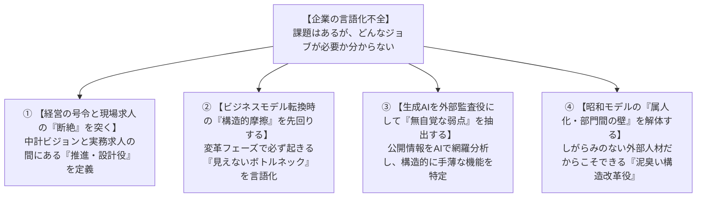

# 【40歳からの転職】求人票は見るな！組織の課題を自ら解く「提案型転職」のススメ

---

## 【序章】このコラムを読む前に：なぜ今「提案型」なのか？

「40歳を過ぎてからの転職活動が、こんなにも苦しいとは思わなかった」  
「何十社も応募したのに、書類選考の段階で機械的に落とされてしまう」  
「20年間必死に積み上げてきたキャリアなのに、社外では何一つ評価されていない気がする」

もしあなたが今、このような焦りや深い行き詰まりを感じているとしたら、最初にお伝えしたいことがあります。

**あなたのこれまでの経験や能力が否定されたわけではありません。戦っている「ゲームのルール」が間違っているだけです。**

特に、これまで伝統的な日本企業（いわゆるJTC）で真面目に組織を支えてきたビジネスパーソンほど、「転職活動＝公開された求人票を探し、そこに自分を当てはめること」という固定観念に縛られがちです。

私自身、ちょうど2001年のあの「超就職氷河期」に社会人となり、これまで4社を経験してきました。直近では47歳で転職を果たし、現在に至っています（※詳しい職歴やプロジェクト実績は[LinkedIn（橋本直久のプロフィール）](https://www.linkedin.com/in/businessinnovator-hashimotohashimoto/)をご参照ください）。

20代の若手時代から40代後半に至るまで、身をもって転職市場とキャリアの変遷を経験してきた実践者として痛感しているのは、**「40代以降のキャリアにおいて、既存の求人票を待って自分を当てはめるだけの活動は、あまりにも自分の価値を毀損し、可能性を狭めてしまう」**ということです。

40代・50代のミドルシニアが20代・30代と同じ「条件検索型の市場」で戦おうとすると、構造的に不利な土俵に立たされることになります。

そこで本稿で提唱したいのが、**「提案型転職（プロアクティブ・キャリア）」**という新しいアプローチです。

> **💡 この記事を読む心構え**  
> 「提案」と聞くと、「自分は起業家でも経営コンサルタントでもないから無理だ」と身構えてしまうかもしれません。しかし、大風呂敷を広げた新規事業プランなど不要です。  
> 本稿でいう提案とは、**「あなたが社内で当たり前にやってきた業務経験（調整・改善・リスク管理・プロジェクト推進など）を、相手企業の『言語化できていない困りごと』の言葉に翻訳して差し出すこと」**です。

この記事を読み終えたとき、あなたは以下の3つの変化を手にしているはずです。

1. **書類選考で落とされ続ける「構造的な理由」と「採用プロセスの本質」が腑に落ち、無駄な消耗がなくなる**
2. **面接が「一方的に品定めされる場」から「対等なビジネス商談・対話の場」へ変わる**
3. **5つのタイプ診断を通じて、自分の強みを活かした「無理のない提案型転職活動」に自信を持って挑めるようになる**

それでは、なぜ40代以降の転職市場でルールが激変するのか、そのカラクリから紐解いていきましょう。

---

## 【第1部】転職市場を「不動産」で考えると、苦戦の理由がすべてわかる

### 若手市場は「ワンルーム賃貸（SUUMO検索）」
20代〜30代前半の転職市場は、不動産でいえば「ワンルームや1LDKの賃貸探し」に似ています。

* 家賃（年収）
* 広さ・間取り（職種・ポジション）
* 駅徒歩・築年数（年齢・社会人経験年数）

比較軸が標準化されているため、求人サイトで条件にチェックを入れて検索すれば、大量の候補がヒットします。企業側も「既存業務の欠員補充」が主目的であるため、スペック検索で効率よく若手をスクリーニングします。

その結果、**求職者側に起こる冷酷な現実は「完全なスペック比較と価格（年収）競争」**です。

比較軸が「年齢・職種・経験年数・年収」、さらには「現職の企業ブランド」や「中途転職であるにもかかわらず出身大学名」といった画一的な記号に還元されるため、候補者は**「代替可能な量産品」**として横並びで比較されます。企業側には「同じスキルなら1歳でも若い方を」「同じ年齢なら1円でも安い方を」「少しでも有名な社名や大学名を」というスクリーニングの合理性が働くため、人柄や仕事へのスタンスといった本質的な深みは見られないまま、わずかな記号やスペックの差で機械的に足切りされる消耗戦に巻き込まれるのです。

### 40代以上のミドル市場は「一点ものの特注物件・高級邸宅」
一方、40歳を超えたあなたのキャリアはどうでしょうか。

20年前後のキャリアの中で、成功も失敗も経験し、多様な人間関係を調整し、専門知識と業界の勘所を身につけてきたはずです。これは不動産でいえば、**立地も間取りも設計思想も一件ごとにまったく異なる「一点ものの特注物件や高級邸宅」**です。

しかし、日本の転職市場には今なお根深い問題があります。
それは、**「20代も40代も、まったく同じ転職サービスを使い、同じ定型フォーマットの職務経歴書で勝負してしまっている」という根本的な過ち**です。

求職者は「ハイクラス向け」と銘打たれたビズリーチや大手転職サイトに登録し、若手と何ら変わらない定型の職務経歴書（学歴・社名・役職・資格の箇条書き）を入力してスカウトを待つ。
一方の採用企業側も、40代に求めるべきミッションを言語化できないまま、若手の欠員補充と同じような定型フォーマットの「四角い求人票」を機械的に公開する──。

このような画一的な土俵の上で、旧態依然とした人事やエージェントが行っているのは、
* 「大企業の元部長だから、規模の小さい会社なら活躍できるだろう」
* 「同業他社の元課長だから、そのまま競合の代替要員として使えるだろう」

といった、**極めて刹那的で短絡的な「看板スライド採用」**にすぎません。

その結果どうなるか？  
求職者は「大企業時代の看板」と「転職先のリアルな現場」のギャップに苦しみ、採用した企業側も「期待したほど動いてくれない」と失望する──**求職者にとっても採用企業にとっても、極めて不幸なミスマッチ**が生まれます。このようなスペック当てはめを漫然と続けている人事部門はあまりに時代遅れであり、採用能力がないと言わざるを得ません。

```mermaid
flowchart LR
    subgraph 不動産賃貸（SUUMO）のビジネス構造
        R1["物件（ワンルーム）"] --> R2["【検索データベース】<br/>家賃 / 間取り / 築年数 / 駅徒歩"] --> R3["仲介業者が<br/>効率よく大量処理"] --> R4["入居者<br/>（借り手）"]
    end
    
    subgraph 現代の転職プラットフォームの構造
        J1["求職者<br/>（40代・個人のキャリア）"] --> J2["【転職サイト・一括DB】<br/>年収 / 職種 / 年齢 / 社名 / 大学名"] --> J3["エージェントが<br/>定型スペックで成約処理"] --> J4["採用企業<br/>（買い手）"]
    end
```

| 構造の要素 | 不動産賃貸（SUUMO）の構造 | 現代の転職プラットフォームの構造 |
| :--- | :--- | :--- |
| **取引される対象** | 規格化された賃貸物件 | **求職者（あなたの20年のキャリア）** |
| **比較・検索軸** | 家賃・広さ・築年数・駅徒歩 | **希望年収・職種・年齢・社名・大学名** |
| **プラットフォームの論理** | 標準化された条件で大量の物件を効率よくさばく | **定型フォーマットで大量の候補者をさばき成約手数料を得る** |
| **利用者に起こる現実** | わずかな築年数や家賃差で機械的に検索除外 | **画一的な記号で比較され、買い叩かれ、書類で落とされる** |

多くの転職者は、不動産の物件を自ら購入・特注設計した経験がないのと同様に、**「人材ビジネスの裏側にあるビジネスモデル」**を理解していません。

仲介会社やプラットフォームにとって最も都合が良いのは、「人間を記号化（年齢・年収・職種・社名）し、規格品として右から左へ効率よく流すこと」です。

そして、採用企業が公開された求人票に照らしてスペック比較を行っている場合、何が起きるでしょうか？  
ひとつの求人票に対して無数の応募者が殺到し、**あなたは「大量のライバルのスペック一覧」の中に完全に埋もれてしまいます。**

採用担当者は1通あたり数十秒で条件の一致・不一致を機械的にソート（選別）するため、あなたがどれほど深い思考力や調整力、修羅場の知見を持っていたとしても、**「そもそも面接に行き着く確率」そのものが絶望的に低くなってしまう**のです。

冒頭で述べた「何十社も応募したのに書類選考で落とされ続ける」という現象の正体は、まさにここにあります。  
あなたのこれまでの経験や能力が否定されたのではなく、**「大量のライバルと薄っぺらなスペックを競い合う、構造的に不利な椅子取りゲーム」に自ら身を投げてしまっているから**に他なりません。

### 「本気の企業」は人事戦略と経営戦略を直結させている
いま、40代以上の即戦力を本当に欲している伸びゆく企業は、安直な看板検索などしていません。彼らにとって**「人事戦略は経営戦略そのもの」**だからです。

「元〇〇会社の部長」という過去の肩書ではなく、**「自社のこの未踏の経営課題を、具体的にどんな役割・手腕で突破してくれるのか」**という本質的な機能を見ています。

求職者側が企業の経営課題を読み解き、自ら解決策を提案して飛び込んでいく。
こうした「本気の企業」と「プロアクティブなミドル」が結びつくことこそが、昭和モデルのJTCが凋落していくこれからの日本において、次世代を支える強い組織や産業を再構築する確かな一手となるのです。

### 企業も「どんな役割が必要か」言語化できていない
もう一つの重要な事実は、**企業側の求人が「ミッション型採用」へシフトしている**点です。

人材大手エン・ジャパンの調査（[『ミドルの転職』転職者分析レポート](https://corp.en-japan.com/newsrelease/2025/41395.html)）によると、**ミドル世代（35歳以上）の転職決定数はわずか6年で2.45倍に急拡大**しています。その背景にあるのは単なる欠員補充ではなく、「社内にない専門知識・知見の獲得」や「新規事業・事業変革の推進」を目的とした、変革のための**「外部知見の調達（ミッション型採用）」**の急増です。

しかし、ここには構造的なパラドックスが存在します。
**「社内に知見がない領域だからこそ、企業側も具体的にどんな職務記述書（JD）を書けばいいのか分からない」**という点です。

これは例えるなら、**「英語が話せない校長先生が、英語のネイティブ教師を採用面接し、1年後に『あいつの発音は本当に正しいのか？』と評価するような愚」**が、現代の中途採用の現場で日常茶飯事に起きているということです。

評価する側の経営陣や人事も、その専門領域の「正解」が分かりません。
事実、パーソル総合研究所の調査研究（[『中途入社者を組織にどうなじませるか ～オープン・オンボーディングの科学～』](https://rc.persol-group.co.jp/thinktank/thinktank-column/202204220001/)）でも示されている通り、中途採用者が入社後に直面する最大の壁は「期待される役割や成果基準が曖昧なまま放置される（役割の曖昧性・リアリティショック）」という構造的課題です。

だからこそ、求人票には「経営企画全般」「事業推進リーダー」といった抽象的な言葉しか並びません。

### 20代と40代では「面接官のレイヤー」が全く違う
ここで、見落とされがちな決定的な違いに触れておきましょう。それは**「面接官の役職・責任度合い（レイヤー）」の違い**です。

* **20代の採用**: 人事部の採用担当や現場のチームリーダーが中心（欠員補充・ポテンシャル確認）。
* **40代の採用**: 一次面接が人事のスクリーニング係だったとしても、**実質的な選考の舞台には「事業責任者（事業部長・執行役員）」や「社長・経営陣」が直接登場**します。

彼らは、自社の事業課題や組織の詰まりを何とか解決したいと切実に願って面接に臨んでいます。
それにもかかわらず、求職者側が今まで通りの感覚で職務経歴書を差し出し、共通のビジネス言語もすり合わないまま、**「過去の自慢話」と「抽象的な質疑応答」を小一時間交わして採否を決める──これこそが、双方にとって最も危険な「ギャンブル面談」、言うなれば「採用ガチャ（シニア版）」**です。

経営陣が喉から手が出るほど欲しいのは、過去の肩書ではなく**「うちのこの課題を、あなたならどう解いてくれるのか」という未来の処方箋**です。

だからこそ、求職者側から「御社の課題は〇〇ですね。私の経験なら、このように解決できます」と仮説を持ち込む（＝提案型アプローチ）ことが、意思決定者である役員・社長にとって強烈な救いとなるのです。

---

## 【第2部】あなたはどのタイプ？ 5つの価値観で選ぶ「私の提案スタイル」

「提案型」と言っても、全員が同じやり方をする必要はありません。あなたの仕事の価値観に合わせて、最も心地よいスタイルを選びましょう。

まずは、スマートフォンで2分でできる診断ツールをご用意しました。

---

> ### 🧭 【Web診断ツール】提案型転職 あなたのタイプは？
> あなたの強み・価値観のバランスを可視化するレーダーチャートと、あなた専用のアクション処方箋がすぐに出力されます。
> 👉 **[Web診断ツール「提案型転職 あなたのタイプは？」を開く（無料・登録不要）](https://naohiro-s.github.io/proud-babbage/)**  
> *(※ローカル環境でご覧の方は同フォルダ内の `index.html` または `提案型転職_5タイプ価値観診断ツール_20260829.html` をブラウザで開いてください)*

---

### 5つのタイプと「提案」のグラデーション

```
【Type A：安定実行型】 ──「確実な運用とリスク低減」をA4 1枚で提示
【Type B：専門追求型】 ──「特定領域のボトルネック解消」を専門レポートで提示
【Type C：関係協働型】 ──「論点メモ」をもとに対話しながら一緒に役割をつくる
【Type D：課題解決型】 ──「課題仮説＋改善アプローチ（3〜5枚）」を持ち込む
【Type E：事業創造型】 ── 求人の有無に関わらず「事業構想・新ポジション」を提案
```

#### ① Type A：安定実行型（着実な改善・リスク管理）
* **特徴**: 役割が明確な環境で真価を発揮。大風呂敷よりも日々の運用の安定と品質向上を重視。
* **提案の型**: **「業務改善・安定運用シート（A4 1枚）」**  
  「入社後、業務の標準化やリスク低減、ミスのない体制づくりにどう貢献できるか」を簡潔に示します。

#### ② Type B：専門追求型（深い知見・スペシャリスト）
* **特徴**: 特定領域の専門性を深め、プロとして難問を解決することに誇りを持つ。
* **提案の型**: **「専門領域の技術・実務分析シート（2〜3枚）」**  
  経営全体ではなく、自分の専門（経理、知財、特定技術等）に絞って課題解決策を提示します。

#### ③ Type C：関係協働型（チーム支援・対話共創）
* **特徴**: 人間関係や組織の一体感を重視。傾聴とファシリテーションで周囲を動かす。
* **提案の型**: **「対話型・論点整理メモ（A4 1枚・アジェンダ形式）」**  
  完成品を押し付けるのではなく、「御社の現在の組織論点」を並べて面接で一緒に議論します。

#### ④ Type D：課題解決型（問題設定・仮説検証）
* **特徴**: 曖昧な状況から課題を発見し、自ら仕組みを変えていく推進力を持つ。
* **提案の型**: **「課題仮説＋改善アプローチシート（3〜5枚）」**  
  企業のIRやニュースから課題を分析し、「私ならこう着手する」というプロセスを構造化します。

#### ⑤ Type E：事業創造型（パイオニア・ゼロイチ型）
* **特徴**: 既存の枠に収まらず、新しい事業や仕組みをゼロから立ち上げたい。
* **提案の型**: **「事業構想・新ポジション提案書（5〜10枚）」**  
  求人が出ていない企業に対しても、経営課題を解決する新部門やリーダーの席そのものを提案します。

---

## 【第3部】実践！企業が言語化できていない「空白の役割」をあぶり出し、充足を主張する4つのアプローチ

世の中の転職ノウハウ本は、「職務経歴書のフォーマット」や「面接での想定問答（トークスクリプト）」ばかりを解説します。しかし、そんな小手先のテクニックは本質ではありません。

40代以上の転職において真に勝負を分けるのは、**「企業自身も言語化できていない『空白の役割（ミッシングピース）』をあぶり出し、自分をその充足解として提示すること」**です。

ここでは、実戦で使える4つの切り込みアプローチを解説します。



---

### アプローチ1：【経営の号令と現場求人の「断絶（ミッシングリンク）」を突く】
* **企業の言語化不全**:
  * 経営陣は中期経営計画や決算説明会で「DXによる事業変革」「海外アライアンス強化」と壮大なビジョン（号令）を掲げます。
  * しかし人事が出している求人票を見ると、「現場のプログラマー募集」「既存ルート営業募集」など、現場の作業員レベルしか出せていません。
* **切り込みと充足の主張**:
  * 経営の「ありたい姿」と現場の「実務求人」の間にある**「ビジョンを具体的な業務設計とプロジェクトに落とし込む推進役（通訳・設計者）」がすっぽり抜け落ちている**ことを指摘します。
  * **「御社が中計で掲げている〇〇を実現するためには、現場の増員だけでなく、経営と現場を繋ぐ『プロジェクト設計の役割』が不可欠です。私の経験はその結節点を埋めるために使えます」**と主張します。

---

### アプローチ2：【ビジネスモデル転換時に必ず起きる「見えない摩擦」を先回りする】
* **企業の言語化不全**:
  * 「売り切りからサブスクへ」「国内からグローバルへ」など、企業が新しいモデルへ舵を切る際、**組織内には「未踏の領域ゆえの摩擦」**が必ず生じますが、経営陣は何が原因で歯車が狂っているのか言葉にできません。
* **切り込みと充足の主張**:
  * 他社の変革事例や過去の修羅場経験から、「そのフェーズの企業が直面する典型的な機能不全（例：開発と営業の対立、カスタマーサクセスの不在、買収先との評価制度のズレなど）」を先回りして言語化します。
  * **「この変革期において、御社の組織では必ず〇〇の領域で摩擦が起きているはずです。私はこの『見えないボトルネック』を解消する専門の役割として貢献できます」**と、相手の痛いところを言語化して見せます。

---

### アプローチ3：【生成AIを「外部監査役」にして、企業の無自覚な弱点をあぶり出す】
* **企業の言語化不全**:
  * 自社の中にいる人間は、組織の弱点や足りない機能に「慣れ」てしまい、盲点（ブラインドスポット）になっています。
* **切り込みと充足の主張**:
  * 生成AIに「企業のIR資料・中期経営計画」「直近2〜3年の求人票の変遷」「競合他社の組織構造」「社員のクチコミデータ」を投入し、**『この企業が目標達成する上で、構造的に欠落している組織機能・ジョブは何か？』**を客観的に抽出させます。
  * AIによって浮き彫りになった**客観的なファクトベースの「機能不全（ミッシングピース）」**をもとに、「外部から客観分析した結果、御社が次のステージに行くために不足しているのはこの役割です」と提示します。

---

### アプローチ4：【昭和モデルの「属人化・部門間の壁」というブラックボックスを解体する】
* **企業の言語化不全**:
  * 昭和モデルを引きずるJTCや過渡期の企業では、**「定年間近のベテランの頭の中にしかない属人化された業務フロー」**や**「営業と製造の根深い縦割り対立」**が変革の足を引っ張っています。経営陣も問題だと分かっていますが、社内の人間は過去の人間関係やしがらみがあってメスを入れられません（タブー化）。
* **切り込みと充足の主張**:
  * 外部の即戦力という「しがらみのない立場」を逆手に取り、既存の枠組みの外科手術を引き受ける役割を自ら定義します。
  * **「御社のDXや業務効率化が進まない本当の理由は、ツールの問題ではなく、昭和以来の属人化された業務慣習と例外処理のブラックボックスにあります。私は社内の出世レースに関係のない外部人材として、ベテランの知見を尊重しつつ、その暗黙知をすべて可視化・標準化して若手に引き継ぐ『嫌われ役・解体役』を半年でやり切ります」**と提案します。

---

### 💡 ヘッドハンターや企業内製エグゼクティブ採用部隊を「味方」にする
このレベルの採用は、一般の公募サイトよりも**「エグゼクティブ専門のヘッドハンター」**や**「企業内のエグゼクティブ採用内製部隊（ダイレクトリクルーター）」**を経由することが大半です。

ヘッドハンターは成功報酬ビジネスですが、彼らも「大企業の元〇〇部長です」といった看板だけの紹介がクライアントの役員・事業責任者に通用しないことを痛いほど知っています。彼らが喉から手が出るほど求めているのは、**「クライアントの事業責任者に刺さる具体的なキーワードと提案材料」**です。

あなたがこうした「課題解決シート（仮説）」を用意しておくと、ヘッドハンターは**「これこそ事業部長に見せたい武器だ！」**と確信し、あなたを単なる候補者ではなく「クライアントへ持っていく最強のソリューション」として経営陣へ直接売り込んでくれるようになります。

---

## 【第4部】入社後の「死の谷」を越え、自律的に転戦するキャリアへ

提案型転職のゴールは「内定」ではありません。入社後に価値を発揮し、信頼を獲得することです。

### 「即戦力」という呪縛を捨て、アンラーニングせよ
本稿を執筆・検討するプロセスの中で知った言葉ですが、中途採用市場には**「前の会社では…」「大企業では…」「うちの業界では…」と何かにつけて「〜では」を口癖のように連発し、過去の看板や成功体験を振りかざして周囲から孤立してしまう人を指す「出羽守（でわのかみ）」**というスラングがあるそうです。

どんなに素晴らしい提案書で経営陣に認められて入社したとしても、新天地にはその会社固有の歴史、人間関係、暗黙のルールが存在します。

* **最初の90日は「質問者」に徹する**: 過去のプライドを捨て、現場のメンバーに敬意を払い、業務のやり方を素直に学ぶ（アンラーニング／学習棄却）。
* **小さな信頼の残高を積む**: 最初から大改革を振りかざすのではなく、周囲の日常の困りごとを助けることから始める。
* **採用責任者（事業責任者・社長）との「握り」を初年度は維持し続ける**:  
  提案型転職で入社した場合、あなたを採用した真の「発注元」は事業部長や経営陣です。現場の雑務や社内政治に流されず、彼らと合意した「本来解くべき経営課題・達成目標」のすり合わせを定期的に行い、目線をブラさないこと。**採用責任者が最も渇望していた課題に対して確実な成果を出すことこそが、組織内での強固なプレゼンス（発言権と信頼）の獲得に直結します。**

「英語が話せない校長先生」のもとに飛び込むからこそ、相手の文化を尊重しながら、少しずつ共通言語を作っていく謙虚さが求められます。

---

## おわりに：求人票を待つ側から、役割をつくる側へ

### 激動の10年──「転石苔を生ぜず」の真実
世の中も、市場も、組織も、ここ10年の変化のスピードは過去のそれとは比べものになりません。
名門企業の倒産や買収、コングロマリット企業の事業切り売りは日常茶飯事となり、生成AIの登場によって職場のフォーメーションは毎月のように塗り替えられています。

日本には古くから「転石苔を生ぜず（ひとつの場所に腰を据えないと大成しない）」と仕事を評価することわざがあります。しかし、英語の原典である**「A rolling stone gathers no moss.」は、欧米では正反対に「活発に動き続けている石には、不要な苔（しがらみや錆）がつかない＝常に転がり続けよ」**という意味で使われます。

インターネットによる越境的なグローバル競争が激化する現代において、もはや国内完結のぬるま湯組織で逃げ切れるビジネスパーソンはごくわずかです。

### 縦と横の競争、そして「昭和スペック」という最大のギャンブル
採用する企業側も、英語が話せないのに英語の教師を雇い続けていた昭和の老兵は退場し、昭和モデルにしがみつくJTCの凋落は目に見えています。

枠にはめて個人を「代替可能な歯車」としてしか見ない沈みゆく組織に身を置くのか。それとも、新しいビジネスモデルを模索して世界と戦う伸びゆく船に乗るのか──。

伸びゆく船において、個人の競争性はさらに上がります。しかも、40代以上の競争相手は**「横（同世代）」だけではなく、「縦（最新ツールとスピードを武器にする20代、そして生成AI）」**も同時に視界に入れなければなりません。単に年数を積み上げただけのキャリアは、あっという間に20代とAIに席巻される時代です。

会社や組織は今、あらゆる経営課題を**「プロジェクト単位」**で把握し、それを解決するための最良の手段（M&A、組織改編、プロジェクトごとの外部採用）を選んでいます。

そうした時代の要請の中で、**「昭和に決まったフォーマット（職務経歴書）に文字を埋め、過去の肩書や抽象的なスペックだけで勝負をかけること」こそが、相手の気まぐれに身を委ねる最も危険なギャンブル転職**であることに気づいてほしいのです。

### 40代以上のプロフェッショナルこそ、課題を解いて「転戦」せよ
これは、基礎的な実務スキルを習得する途上にある20代・30代に向けた話ではありません。  
20年近くにわたり現場の酸いも甘いも噛み分け、組織の力学や修羅場を知り尽くした**「40代以上のプロフェッショナル」だからこそ実践できる、そしてこれからの人生後半戦の転職において圧倒的な真価を発揮するキャリアの戦い方**です。

一つの組織で課題を解決し、価値を出し切ったら、また次の課題を抱える組織へ──。  
もはや一つの会社に定年まで受け身でしがみつく時代ではありません。自らを「経営課題を解くソリューション」として提案し、変幻自在に活躍の場を渡り歩いていく（プロティアン・キャリア）。

四角い求人票を待つ側から、企業の未解決な課題を見つけて「自分の役割を自らつくる側」へ。  
あなたの中に眠る20年分の重厚な知見は、正しく言語化され提案されさえすれば、激動の時代を生き抜こうとする企業にとって喉から手が出るほど欲しい最強の武器になります。

まずは、あなたの価値観に合った「提案の型」を知ることから始めてみてください。

👉 **[Web診断ツール「提案型転職 あなたのタイプは？」を試してみる](https://naohiro-s.github.io/proud-babbage/)**

あなたの培ってきた経験が、次のステージで最高の価値として花開くことを心から応援しています。

---

### 📚 本稿で参照した主な公的統計・調査データ
* **厚生労働省**: [『令和7年版 労働経済の分析（労働経済白書）』](https://www.mhlw.go.jp/stf/wp/hakusyo/roudou/25/2-3.html) ── 年功賃金プロファイルの推移と生え抜き社員比率
* **総務省統計局**: [『労働力調査（詳細集計）』](https://www.stat.go.jp/data/roudou/sokuhou/nen/dt/index.html) ── 転職者数および転職等希望者数の推移
* **労働政策研究・研修機構（JILPT）**: [『転職市場における人材ビジネスの展開』](https://www.jil.go.jp/institute/reports/2015/0175.html) ── 年齢に伴う要求能力水準と「見えない壁」
* **パーソル総合研究所**: [『中途入社者を組織にどうなじませるか ～オープン・オンボーディングの科学～』](https://rc.persol-group.co.jp/thinktank/thinktank-column/202204220001/) ── 転職者のリアリティ・ショックの構造と組織適応課題
* **エン・ジャパン**: [『ミドルの転職 転職者分析レポート』](https://corp.en-japan.com/newsrelease/2025/41395.html) ── ミドル世代の転職急増（6年で2.45倍）とミッション型採用の動向
